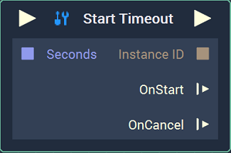
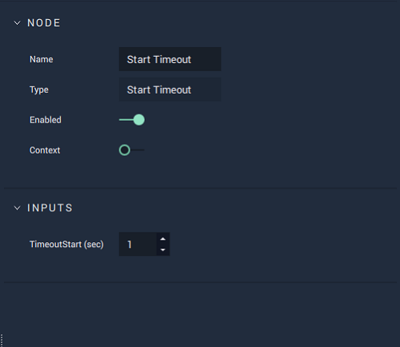

# Start Timeout

## Overview

The **Start Timeout Node** delays the execution of a **Node**.

## Attributes

| Attribute | Type | Description |
| :--- | :--- | :--- |
| `TimeoutStart (sec)` | **Float** | The desired elapsed time of the delay. |

## Inputs

| Input | Type | Description |
| :--- | :--- | :--- |
| _Pulse Input_ \(►\) | **Pulse** | A standard **Input Pulse**, to trigger the execution of the **Node**. |
| `Seconds` | **Float** | The desired elapsed time of the delay. |

## Outputs

| Output | Type | Description |
| :--- | :--- | :--- |
| _Pulse Output_ \(►\) | **Pulse** | A standard **Output Pulse**, to move onto the next **Node** along the **Logic Branch**, once this **Node** has finished its execution. |
| `Instance ID` | **InstanceID** | The assigned **Instance** of an **Object**. |
| `OnStart` \(►\) | **Pulse** | Flows to additional actions following **Start Timeout** when the **Node** is executed |
| `OnEnd` \(►\) | **Pulse** | Flows to additional actions following **Start Timeout** when the execution of the **Node** is cancelled. |

## See Also

* [**Cancel Timeout**](canceltimeout.md)
* An example using the [**Start Timeout Node**](https://docs.incari.com/incari-studio/toolbox/flow-control/sequential#execution-order).

