# Incari Studio Training - Basic Level

This **Basic Level Training** is aimed at users who do not have any previous experience in programming. It starts with exposing all the basic components of **Incari Studio** and then guides the user in building a simple **Project** for them to see what can be achieved in **Incari**.

The objective of this **Training** is to get familiarized with **Incari** and all its components, and then put this knowledge into use by building a **Project**.

## Introduction

### Getting Started

The first step to get started with **Incari** is installation and licensing. For this, follow these steps:

* Register in the **Incari** [website](https://www.incari.com/my-account/) and then activate your account from your e-mail.

* After activating your account, log-in and go to Downloads. Here you can download **Incari Hub**.

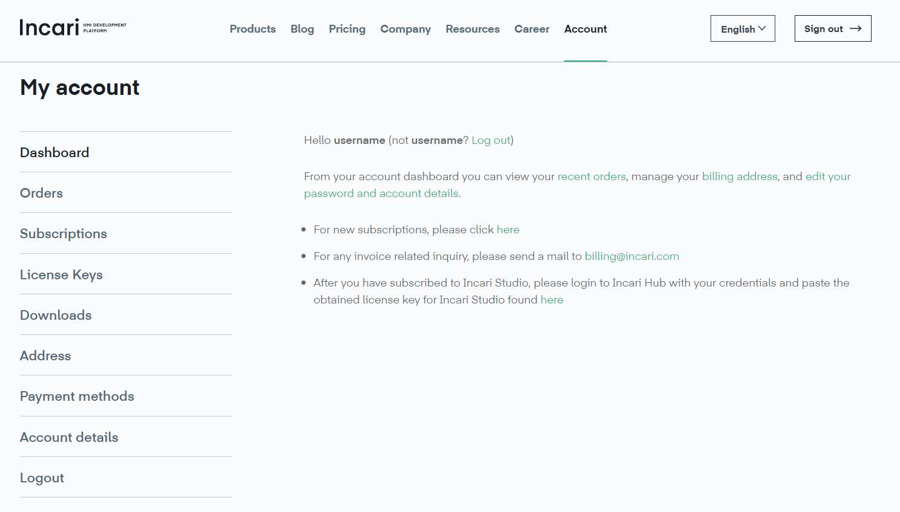

* Install and then start **Incari Hub**. 

* Log-in into **Incari Hub** with your **Incari** credentials.

* In **Incari Hub**, go to the **Incari Studio** tab, under _Applications_. Here you can manage your installed versions of **Incari Studio** and install new ones.

* Press on "Install New". Then you will see the available versions of **Incari Studio** to install.

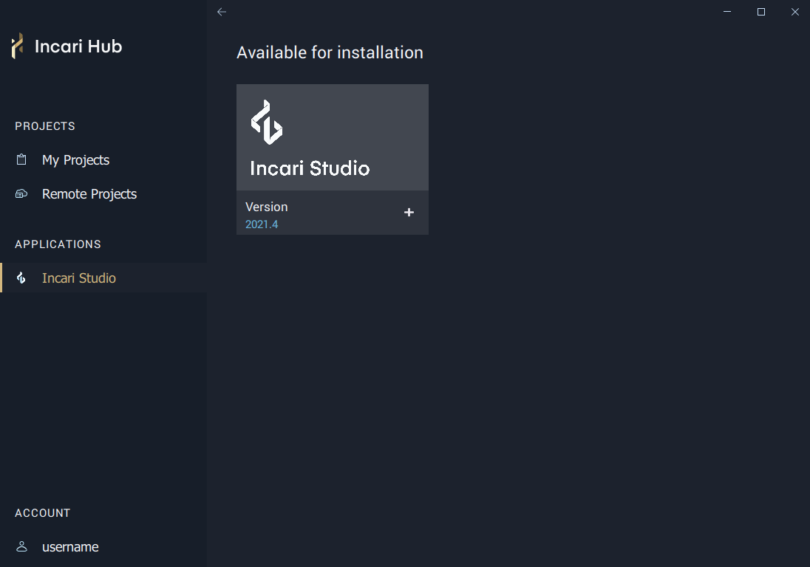

* To install **Incari Studio** 2021.4, press on the plus \(+\) sign and the download will start.

* After the download is finished, the install window for **Incari Studio** 2021.4 will open. Click "Next" to proceed and go through the installation process.

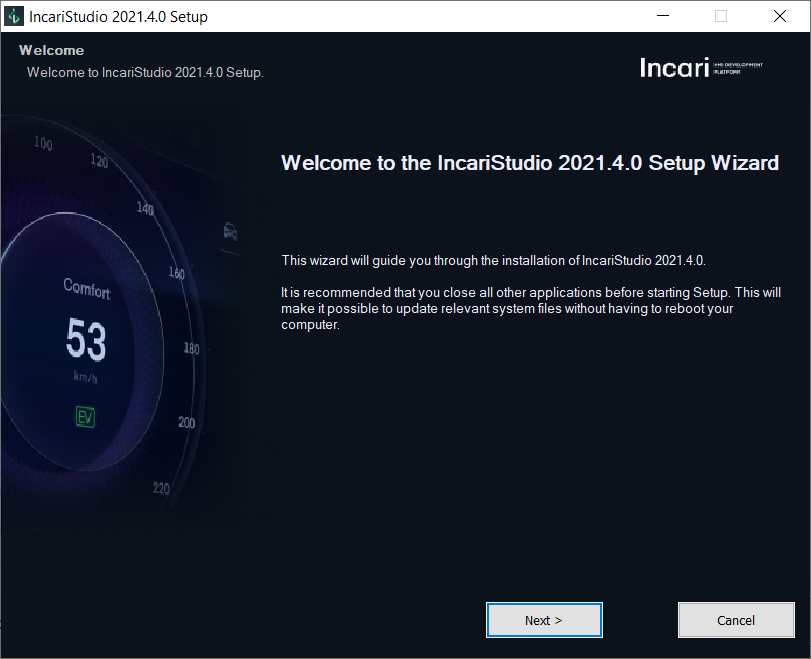

*  Go to the **Incari** [website](https://www.incari.com/my-account/), where you can manage your subscriptions and obtain the license key.

* Use the license key to activate your subscription in **Incari Hub**.

At the moment **Incari** relies on the Windows SDK that comes with [Visual Studio](https://visualstudio.microsoft.com/downloads/) (free version).
So the user also needs to install the Visual Studio 2022 Community Edition (Desktop Development C++ setup), start it once and create a profile.

### Incari Hub

**Incari Hub** serves as a central access point to all **Incari** products. It allows to install the latest version of **Incari**, manage your **Projects**, and obtain **Demo Projects**.

On the left-side Menu, there are two sections: *Projects* and *Applications*.

Under *Projects*, the tab *My Projects* allows the user to access, create, and manage their local **Projects**. The tab *Remote Projects* gives access to **Demo Projects** created by the **Incari** team, these can be downloaded and then opened locally. **Demo Projects** are useful to see how certain functionalities can be implemented in **Incari**.

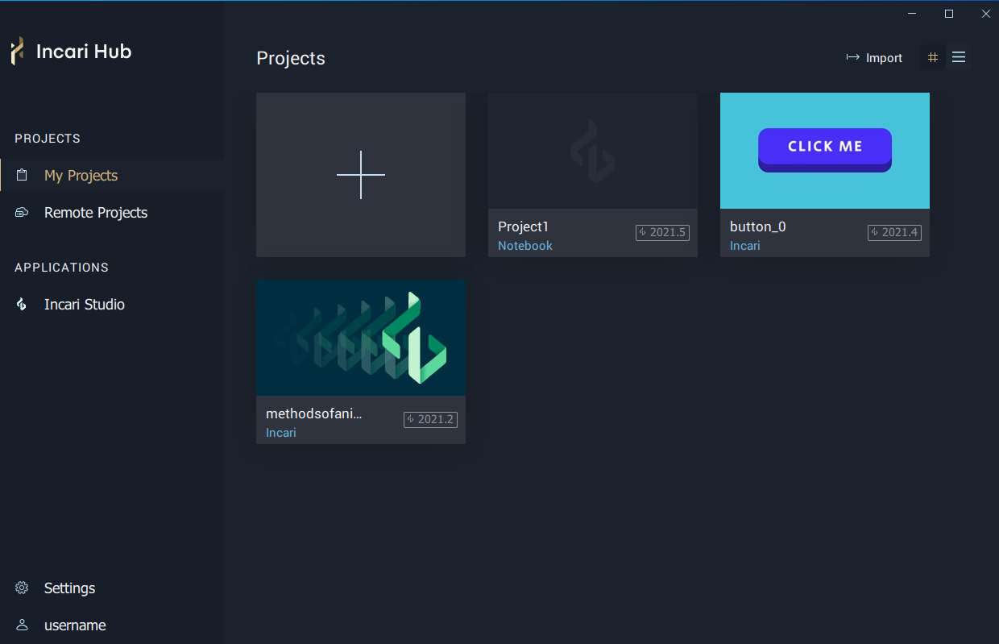

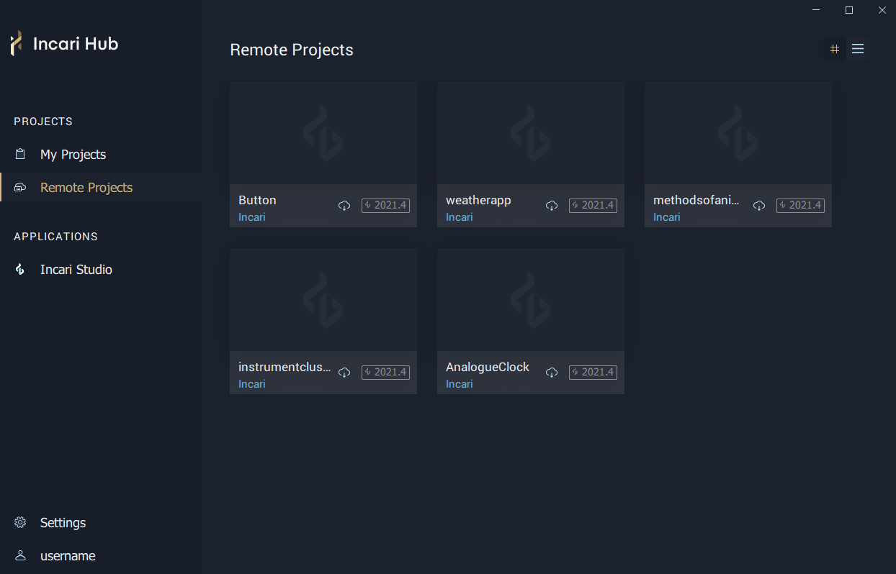

Under *Applications*, **Incari Applications** can be accessed and managed. For each **Application**, it is possible to get the latest version, install it, and check for updates.

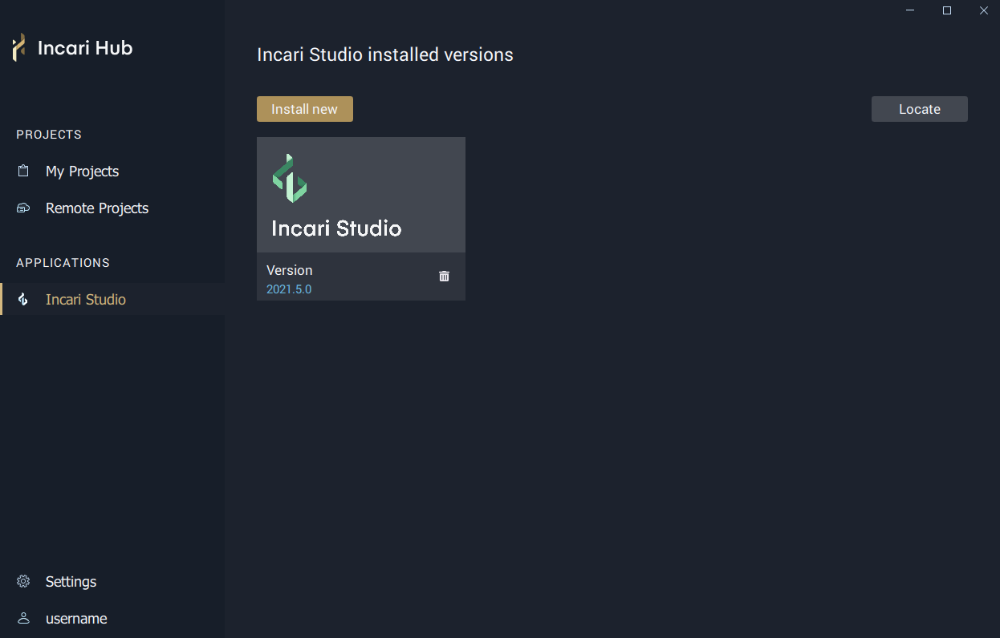

As seen in the previous section, **Incari Hub** also allows to manage the license and user account.

### Incari Studio

**Incari Studio** is an all-in-one tool for the streamlined work of HMI (Human-Machine Interface) creation. It allows for quick UI (User Interface) prototyping and deployment.

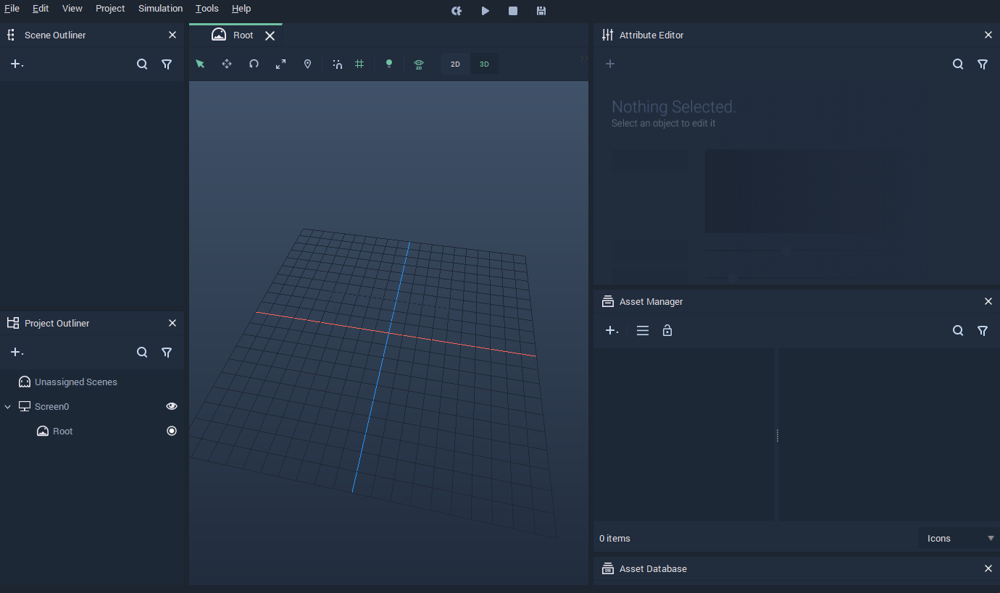

In the usual case, there is a separation between design and development. On one side, developers have to implement the entire interface from source code, and then spend a lot of time reviewing results, adjusting animations, requesting new assets, and iterating the entire process. On the other side, designers may not be aware of software limitations such as animation types or others. With **Incari**, all necessary tools for building UI are available from the beginning. Designers can focus on the interface layout or the creation of animation while developers work on the logic and providing data sources, then both parts can be easily connected thus implementing the entire UI.

The main features of **Incari Studio** are:

   * It is easy to import and use designs from tools such as _Sketch_, _Figma_ or _Photoshop_.
   * The **Animation Editor** incorporated in **Incari** allows to create advanced animations of UI elements.
   * Features implementation can be easily reused, thus speeding up **Project** production.
   * It supports any input source, be it haptic, auditory, visual, or external from CAN, MQTT, HTTP.

### Incari Player

**Incari Player** is the component that displays **Projects** created in **Incari Studio**. It runs as a stand-alone application in which **Incari** **Projects** can be loaded and played.

It can receive external communication from sources such as HTTP, Bluetooth, CAN bus, MQTT, NAV.

**Incari Player** is focused on performance and stability. For example, it does not waste GPU time in calculating elements that are not visible for the user. 

It supports multiple screens and out-of-the-box data synchronization between scenes, thus making it easy to have synchronized multi-screen animations or interaction between elements in differents screens.

### User Interface Overview

For a quick overview of the general interface in **Incari Studio**, we will use one of the **Demo Projects**.

First, we have to download it from the *Remote Projects* tab in **Incari Hub**, and then we can load it from the *My Projects* tab.

We choose the `methodsofanimation` **Project**. In the *Remote Projects* tab, we find it and click on the cloud to download it.

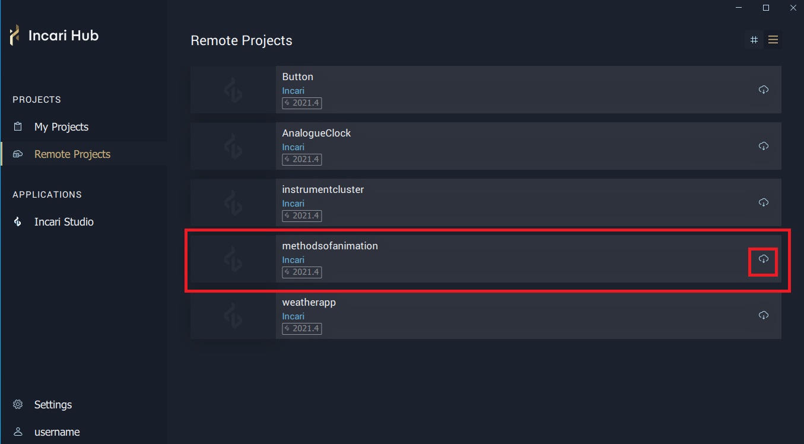

Then, the **Project** should appear in the *My Projects* tab, where we can load it by clicking on the play button that appears when we hover over the **Project**.

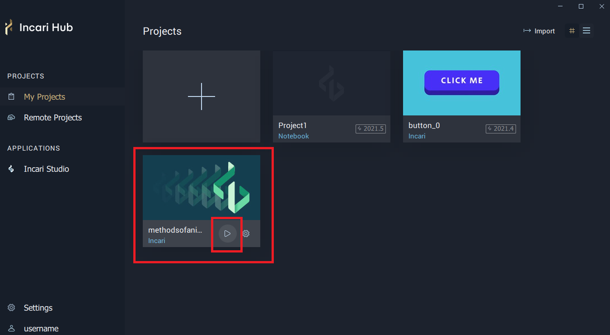

Now with the **Demo Project** loaded we can have a quick overview of the interface.

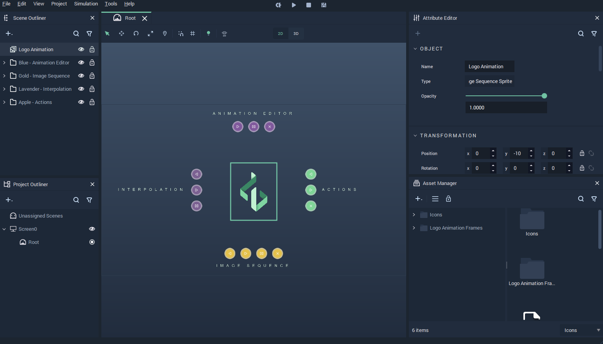

The components of the interface in **Incari** are called **Modules**. Each one has a different purpose, in the next section we give an overview of their functionalities. **Modules** can be either visible or hidden. Choosing which ones are visible can be done by right-clicking the top bar and selecting or deselecting them. Moreover, **Modules** can also made visible from the `View` menu in the top bar and they can be hidden by clicking the `X` at the top right of each of them.

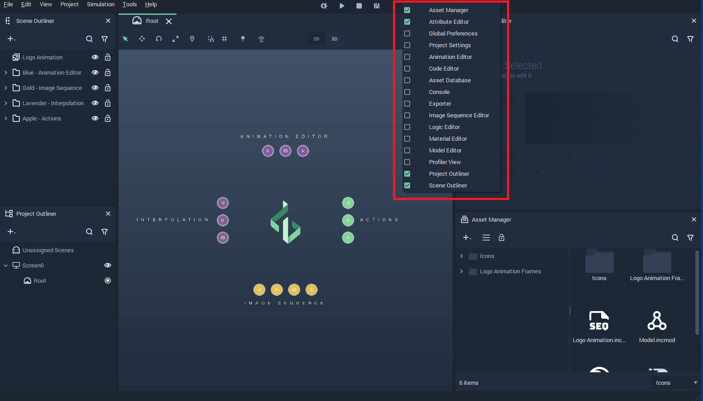

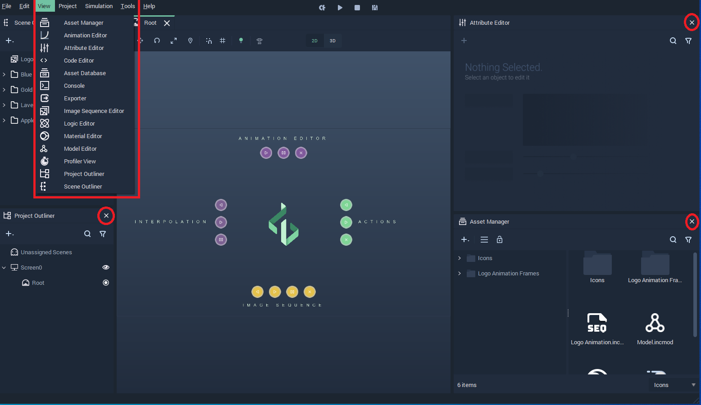

### Project Creation

### Basic Concepts

* Screen and Scene
* Coordinate system
* Visual programming

## Modules

There are several **Modules** that subset the available functionality within **Incari**. These **Modules** provide tools and organizational abilities to the user. 
### Project Outliner

The **Project Outliner** contains a structured list of every **Scene** and **Screen** in a **Project** and can be used to organize, manage, create, and delete them. It is located in the bottom left corner on start.

Adding a **Screen** is simple.

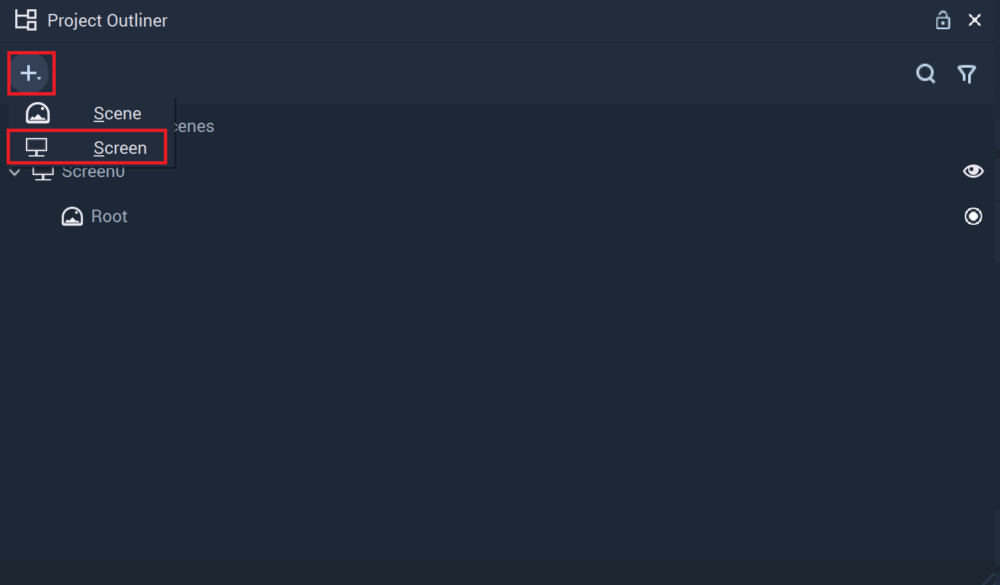

The user can either:
* Click on the plus, then click the `Screen` button (shown in the image above).
* Or right-click inside the **Project Outliner** and select `Create` &gt; `Screen` from the pop-up.
* Or select `File` &gt; `New Screen` from the drop-down **Menu**.
* Or pressing `Ctrl`+`N` while the **Project Outliner** is active.

The user can customize the **Screen** in the **Attribute Editor** (which will be covered soon). For now, it's enough to know that it is possibel to alter the screen in terms of `Transformation`, `Camera`, `Background Color`, and more. 

Adding a **Scene** is the same, except `Scene` is selected instead of `Screen`.

It is possible to move a **Scene** from one **Screen** to another by clicking and dragging. 

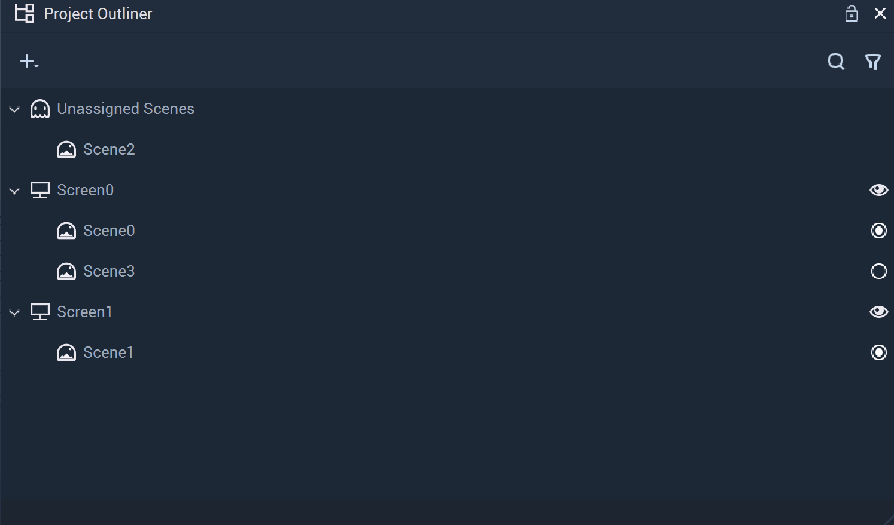

Unless a **Scene** is assigned to a **Screen**, it will appear under `Unassigned Scenes` and will be excluded from the **Simulation**. When a **Scene** is created it is unassigned by default -- unless a **Screen** was selected when it was created, then it will be assigned to that **Screen**.

Playing a **Screen** requires selecting a root **Scene**, if there is more than one. The user can play two **Screens** at once and two **Players** will show on the computer screen. The image below gives an example of this and the red boxes enclose the respective root **Scenes**, which are the **Scenes** that are displayed. 

### Asset Manager

This is the place where all project **Assets** are managed. **Assets** are the files in the **Project Asset** folder. The user can organize resources into folders, search for **Assets** by name,
 or use a view filter to display only specific types of **Objects**.

It is also a place where the user can create new **Assets** like Animations, ImageSequences, Materials, Models, and a couple of others. 

When the user wishes to use **Assets** in a **Project** they have to drag and drop them into a **Scene**, which will add that **Asset** to **Scene Outliner**. 

**Assets** can be imported by clicking on the plus  icon at the 
top left of the **Asset Manager**, selecting `Import Assets`, and finding the files to import to the **Asset Manager**.

For creating an **Asset**, right-click on the **Asset Manager**, select `Create Asset`, and choose which kind of **Asset** to create.
 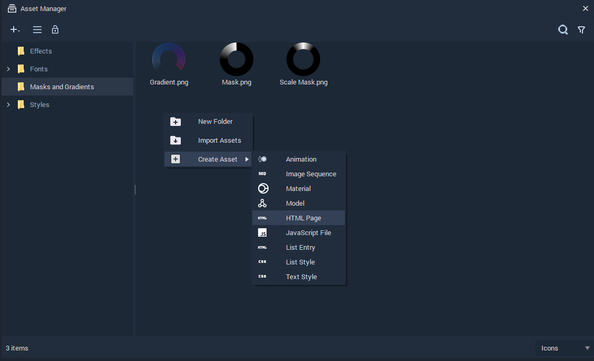

**Assets** can be deleted in the following ways:

* Right-click the **Asset** and select the `Delete` button from the pop-up.
* Select an **Asset** and press `del`.

**Assets** can be renamed by right-clicking an item and selecting `Rename`. You can then type a new name and press **`⏎`**/`Return` to confirm the change.

The **Asset Manager** offers different views of the files in the **Assets** folder. The general view can be switched on the top left between flat 
and folder tree view and the files can be seen as either icons or in a list, which is chosen in the bottom right corner.

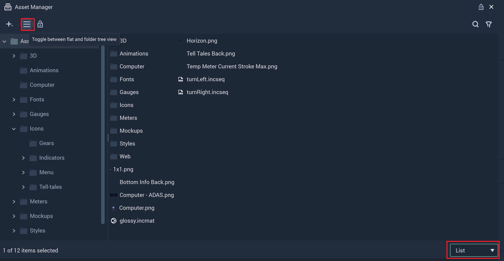

## Project

### Create New Project

### Feature 1: Telltales

### Feature 2: Turn Indicator

### Feature 3: Top Info Bar

### Feature 4: Speedometer

### Feature 5: Battery Indicator

### Feature 6: Gear Indicator

### Feature 7: Implement Logic for Startup

### Feature 8: 3D Assets