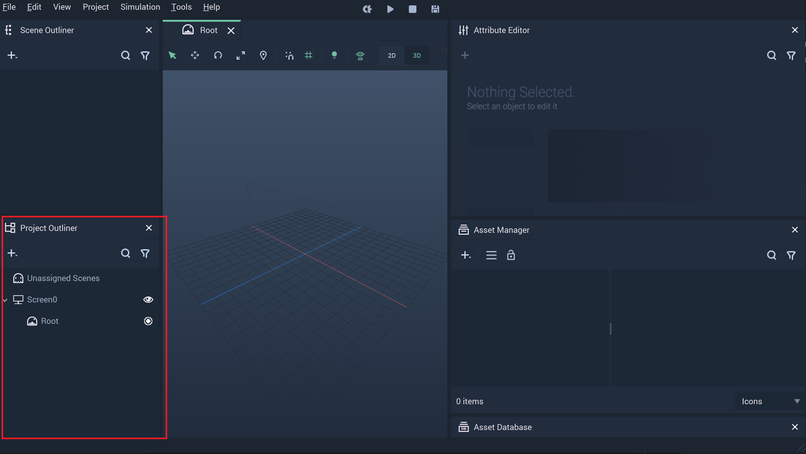
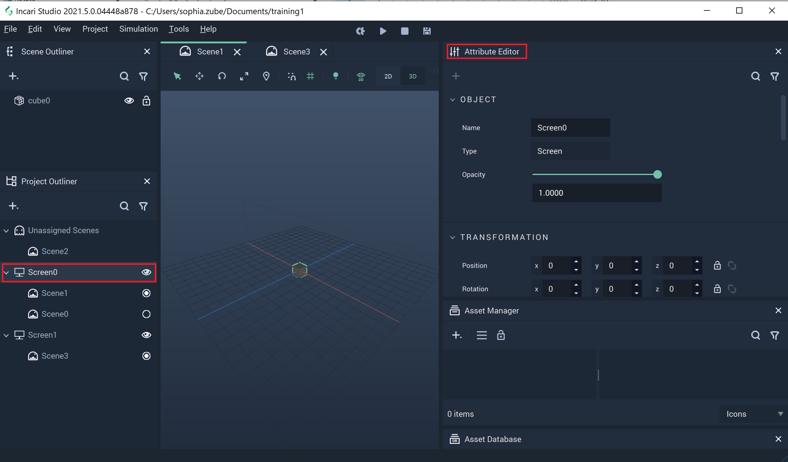
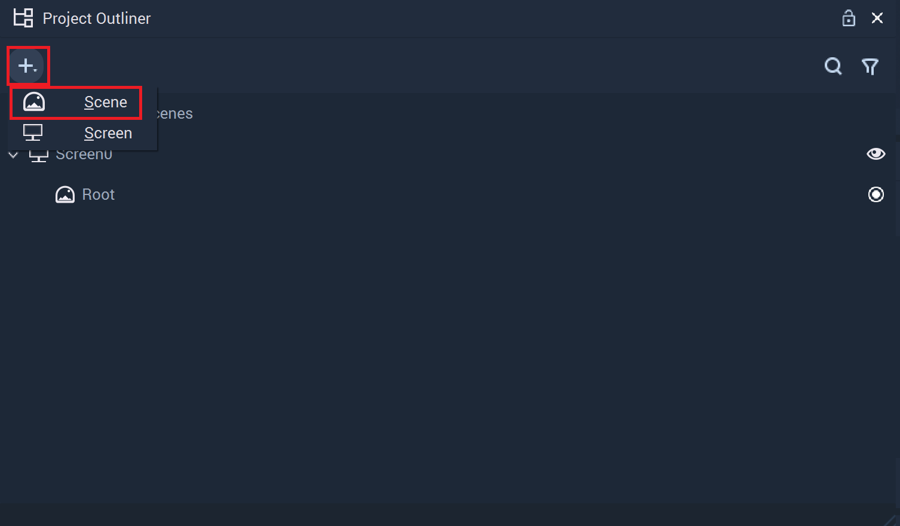
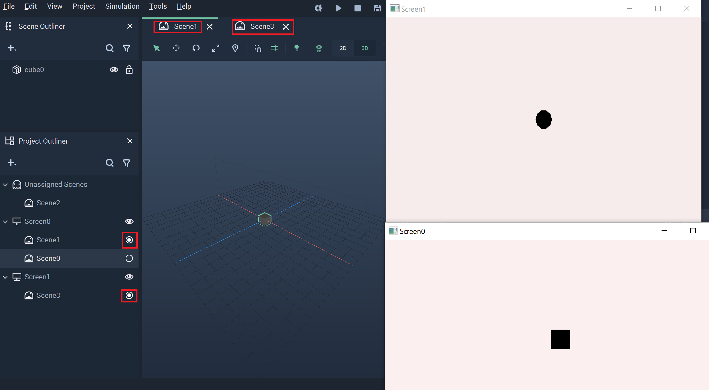

# Incari Studio Training - Basic Level

This **Basic Level Training** is aimed at users who do not have any previous experience in programming. It starts with exposing all the basic components of **Incari Studio** and then guides the user in building a simple **Project** for them to see what can be achieved in **Incari**.

The objective of this **Training** is to get familiarized with **Incari** and all its components, and then put this knowledge into use by building **Project**.

## Introduction

### Getting Started

### Incari Hub

**Incari Hub** serves as a central access point to all **Incari** products. It allows to install the latest version of **Incari**, manage your **Projects**, and obtain **Demo Projects**.

On the left-side Menu, there are two sections: *Projects* and *Applications*.

Under *Projects*, the tab *My Projects* allows the user to access, create, and manage their local **Projects**. The tab *Remote Projects* gives access to **Demo Projects** created by the **Incari** team, these can be downloaded and then opened locally. **Demo Projects** are useful to see how certain functionalities can be implemented in **Incari**.

Under *Applications*, **Incari Applications** can be accessed and managed. For each **Application**, it is possible to get the latest version, install it, and check for updates.

As seen in the previous section, **Incari Hub** also allows to manage the license and user account.

### Incari Studio

**Incari Studio** is an all-in-one tool for the streamlined work of HMI (Human-Machine Interface) creation. It allows for quick UI (User Interface) prototyping and deployment.

In the usual development, there is a separation between design and 

The main features of **Incari Studio** are:

   * It is easy to import and use designs from tools such as _Sketch_, _Figma_ or _Photoshop_.
   * The **Animation Editor** incorporated in **Incari** allows to create advanced animations of UI elements.
   * Features implementation can be easily reused, thus speeding up **Project** production.
   * It supports any input source, be it haptic, auditory, visual, or external from CAN, MQTT, HTTP.

### Incari Player

**Incari Player** is the component that displays **Projects** created in **Incari Studio**. It runs as a stand-alone application in which **Incari** **Projects** can be loaded and played.

It can receive external communication from sources such as HTTP, Bluetooth, CAN bus, MQTT, NAV.

**Incari Player** is focused on performance and stability. For example, it does not waste GPU time in calculating elements that are not visible for the user. 

It supports multiple screens and out-of-the-box data synchronization between scenes, thus making it easy to have synchronized multi-screen animations or interaction between elements in differents screens.

### User Interface Overview

For a quick overview of the general interface in **Incari Studio**, we will use one of the **Demo Projects**.

### Project Creation

### Basic Concepts

## Modules

There are several **Modules** that subset the available functionality within **Incari**. These **Modules** provide tools and organizational abilities to the user. 
### Project Outliner

The **Project Outliner** contains a structured list of every **Scene** and **Screen** in a **Project** and can be used to organize, manage, create, and delete them. It is located in the bottom left corner on start.

Adding a **Screen** is simple.

The user can either:
* Click on the plus, then click the `Screen` button (shown in the image above).
* Or right-click inside the **Project Outliner** and select `Create` &gt; `Screen` from the pop-up.
* Or select `File` &gt; `New Screen` from the drop-down **Menu**.
* Or pressing `Ctrl`+`N` while the **Project Outliner** is active.

The user can customize the **Screen** in the **Attribute Editor** (which will be covered soon). For now, it's enough to know that it is possibel to alter the screen in terms of `Transformation`, `Camera`, `Background Color`, and more. 

Adding a **Scene** is the same, except `Scene` is selected instead of `Screen`.

It is possible to move a **Scene** from one **Screen** to another by clicking and dragging. 

Unless a **Scene** is assigned to a **Screen**, it will appear under `Unassigned Scenes` and will be excluded from the **Simulation**. When a **Scene** is created it is unassigned by default -- unless a **Screen** was selected when it was created, then it will be assigned to that **Screen**.

Playing a **Screen** requires selecting a root **Scene**, if there is more than one. The user can play two **Screens** at once and two **Players** will show on the computer screen. The image below gives an example of this and the red boxes enclose the respective root **Scenes**, which are the **Scenes** that are displayed. 

## Project

### Create New Project

### Feature 1: Telltales

### Feature 2: Turn Indicator

### Feature 3: Top Info Bar

### Feature 4: Speedometer

### Feature 5: Battery Indicator

### Feature 6: Gear Indicator

### Feature 7: Implement Logic for Startup

### Feature 8: 3D Assets